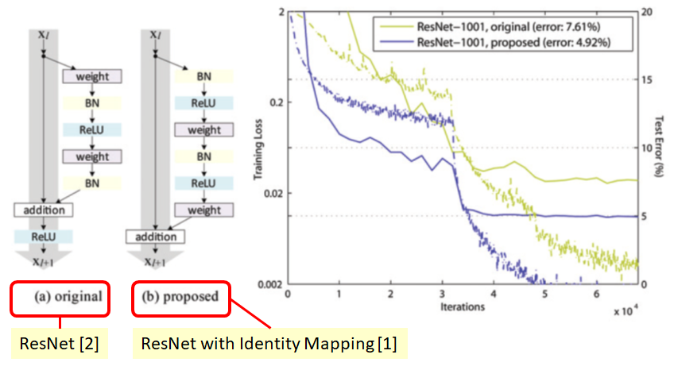

# Table of contents
- [Table of contents](#table-of-contents)
  - [Identity Mappings in Deep Residual Networks, 2016 ](#identity-mappings-in-deep-residual-networks-2016-)
      - [What](#what)
      - [How](#how)
  - 
      - [What](#what-1)
      - [How](#how-1)

## Identity Mappings in Deep Residual Networks, 2016 

#### What

    Improving the results of the original ResNet via some investigation of the informational propagations  
    in forward and backward passes.
#### How

    Skip connections should keep clear information. Don't put any function(impediment) in this river of information, only  
    adding from residual blocks(those can be negative). It becomes more important as the depth of NN grows.  
    Several aproaches were tested: gating, 1x1 convolutions, dropout, etc.
    
    BN + ReLU are considered as pre-activations, the output of the residual block should be in $$(-\infty, \infty)$$.  
    And this leads to reducing overfitting because weight layers get normalized(???) features.  
    (I don't understand the logic of this conclusion, but there are experiments that show the phenomena)

    

##  

#### What
#### How

