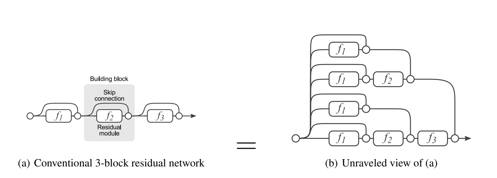
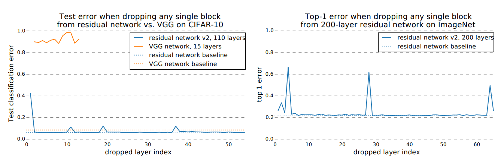
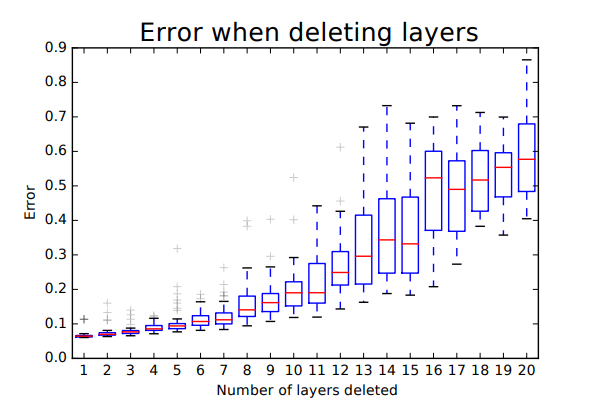
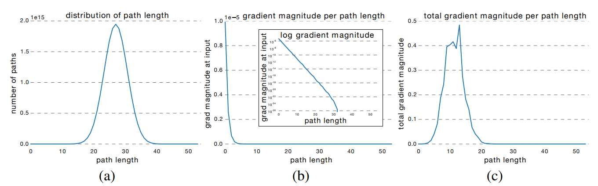

# Table of contents
- [Table of contents](#table-of-contents)
  - [Identity Mappings in Deep Residual Networks, 2016 ](#identity-mappings-in-deep-residual-networks-2016-)
    - [What](#what)
    - [How](#how)
  - [Residual Networks Behave Like Ensembles of Relatively Shallow Networks, 2016 ](#residual-networks-behave-like-ensembles-of-relatively-shallow-networks-2016-)
    - [What](#what-1)
    - [How](#how-1)

## Identity Mappings in Deep Residual Networks, 2016 

### What

    Improving the results of the original ResNet via some investigation of the informational propagations  
    in forward and backward passes.
### How

    Skip connections should keep clear information. Don't put any function(impediment) in this river of information, only  
    adding with the output residual blocks(those can be negative). It becomes more important as the depth of NN grows.  
    Several aproaches were tested and failed: gating, 1x1 convolutions, dropout, etc.
    
    BN + ReLU are considered as pre-activations, the output of the residual block should be in $$(-\infty, \infty)$$.  
    And this leads to reducing overfitting because weight layers get normalized(???) features.  
    (I don't understand the logic of this conclusion, but there are experiments that show the phenomena)

  

## Residual Networks Behave Like Ensembles of Relatively Shallow Networks, 2016 

### What

    They propose a novel interpretation of residual networks showing that they can be seen as a collection  
    of many paths of differing length. The paths are quiet independent of each other, and gradient mostly flows  
    along paths of ~10 length.

  

### How

    They condacted several lesion studies, which show that ResNet can be considered as an ensemble of several shallow NN with  
    a depth ~10

    In the first experiment, authors deleted one residual-block and computed score on the test dataset. The results show only downsampling layers are critical, other layers but be removed without significant deterioration of the network quality

  

    In the second experiment, authors removed several residual-blocks. The result confrims that ResNet can be viewed as ensemble  
    of NN

  

    In the third experiment, magnitude of gradient on a path of length k was analyzed. They did following to count magnitude: they took pretrained ResNet54, feed a batch forward throught the whole network, then k layers were sampled and for its gradient flowed only throught residual-blocks, for others (54 - k) layers gradient flowed only throught skip-connections. Thus, they only measure gradients that flow through the single path of length k. The results show that the gradient magnitude of a path decreases exponentially with the number of modules it went through in the backward pass. Total gradient magnitude was computed in this way:  
    Total gradient magnitude of len k = |layers of len k| * expected magnitude of gradient on len k. So effective paths have len between 7 an 14. Experiment where they trained the network updating only 24 layers per batch, confirms conclusion about the length effective paths.

  

